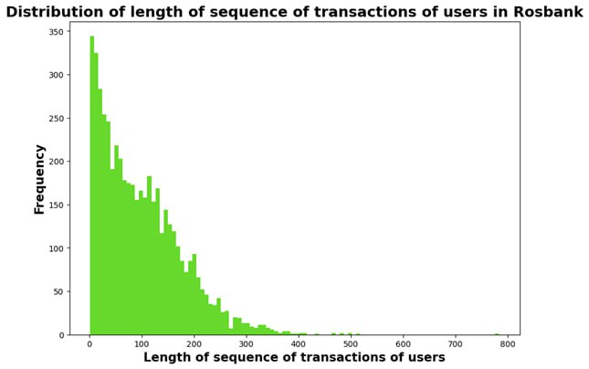
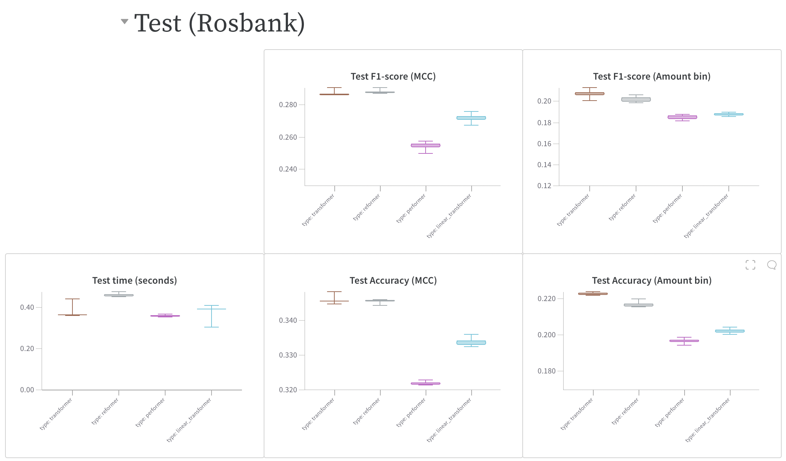
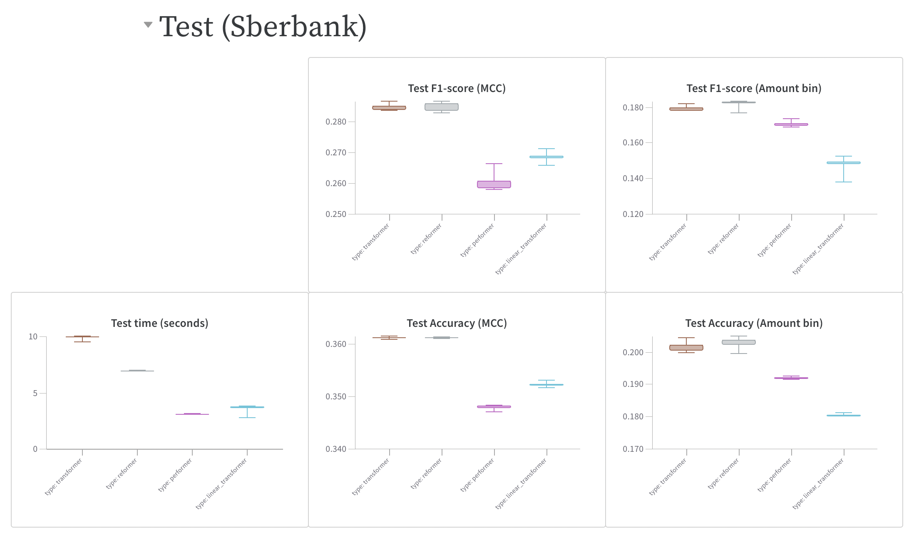

# Efficient transformers on transactional data
This repository contains a code implementation of the final project **Efficient transformers on transactional data** for Deep Learning 2023 course.

__Project team:__

1) Egor Fadeev
2) Matvey Lukyanov
3) Aleksandr Odnakov
4) Aleksandr Yugay

One of the drawbacks of transformer models is quadratic complexity $\mathcal{O}(N^2)$ of attention mechanism with respect to input sequence length $N$. Various modifications were proposed by researchers to overcome this problem. In this project we train different types of efficient transformers (Linear Transformer, Performer and Reformer) on transactional data and compare their performance in terms of quality metrics and training/inference time with the standard transformer.


## Quickstart
To run the default experiments, use the following command:
```commandline
git clone https://github.com/aayugay99/efficient_transformers_on_transactional_data
cd efficient_transformers_on_transactional_data
pip install -r requirements.txt
sh data_download
```
If you want to run the model with your own hyperparameters — change the corresponding values in `config.yaml`

## Data
[Rosbank](https://storage.yandexcloud.net/di-datasets/rosbank-ml-contest-boosters.pro.zip)



[Sberbank](https://storage.yandexcloud.net/di-datasets/age-prediction-nti-sbebank-2019.zip)


## Results
Results on test dataset for Rosbank:



Results on test dataset for Sberbank:



Other results can be found here:

[WandB report](https://wandb.ai/aayugay99/deep-learning-project/reports/MansLearning-Report--Vmlldzo0NDM2Njc3?accessToken=yaqmhul2isbt4cnp66qkz5nd70vc4m6p920u9guv4d97q2za52bee80isxvejmb7)

## Summary
* Efficiency of transformers can be seen on big length sequence (1000 in our case)
* Ranking of train time of transformers on sber is in line with their complexity
* Reformer showed outstanding performing, insignificance difference from full transformer
* Performer and linear transformer has the worst performance

## Citations

```bibtex
@inproceedings{katharopoulos-et-al-2020,
  author    = {Katharopoulos, A. and Vyas, A. and Pappas, N. and Fleuret, F.},
  title     = {Transformers are RNNs: Fast Autoregressive Transformers with Linear Attention},
  booktitle = {Proceedings of the International Conference on Machine Learning (ICML)},
  year      = {2020},
  url       = {https://arxiv.org/abs/2006.16236}
}
```

```bibtex
@misc{choromanski2020rethinking,
    title   = {Rethinking Attention with Performers},
    author  = {Krzysztof Choromanski and Valerii Likhosherstov and David Dohan and Xingyou Song and Andreea Gane and Tamas Sarlos and Peter Hawkins and Jared Davis and Afroz Mohiuddin and Lukasz Kaiser and David Belanger and Lucy Colwell and Adrian Weller},
    year    = {2020},
    eprint  = {2009.14794},
    archivePrefix = {arXiv},
    primaryClass = {cs.LG}
}
```

```bibtex
@inproceedings{kitaev2020reformer,
    title       = {Reformer: The Efficient Transformer},
    author      = {Nikita Kitaev and Lukasz Kaiser and Anselm Levskaya},
    booktitle   = {International Conference on Learning Representations},
    year        = {2020},
    url         = {https://openreview.net/forum?id=rkgNKkHtvB}
}
```
